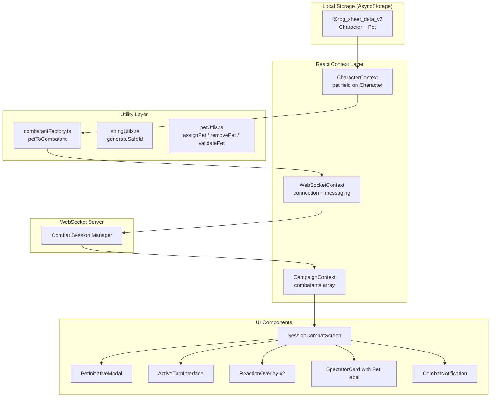
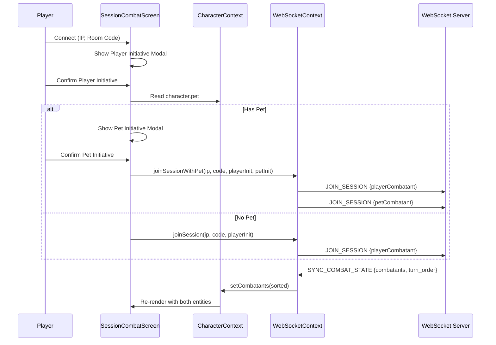

# Design Document: Pet Monster Combat

## Overview

This feature extends the Pharos RP combat system to allow a player to control a pet monster alongside their main character during online WebSocket-based combat sessions. The pet monster is stored locally as part of the player's character data, converted to the existing `Combatant` format when joining combat, and participates with its own initiative, turn actions, and reactions — all controlled by the owning player.

The design leverages the existing architecture: `CharacterContext` for local state/persistence, `CampaignContext` for combat state, `WebSocketContext` for server communication, and the session component library (`ActiveTurnInterface`, `ReactionOverlay`, `SpectatorCard`) for UI rendering.

### Key Design Decisions

1. **Pet stored within Character record** — The pet is persisted as an optional field on the existing `Character` interface under the same AsyncStorage key (`@rpg_sheet_data_v2`). This avoids a separate storage key and keeps the data co-located with its owner.

2. **Reuse of `npcToCombatant` mapping pattern** — A new `petToCombatant` factory function follows the same field-mapping logic as `npcToCombatant`, but uses a composite ID (`petName_ownerName`) and sets `type: "player"`.

3. **Sequential JOIN_SESSION messages** — Rather than introducing a new batch message type, the client sends two `JOIN_SESSION` messages over the same WebSocket connection (player first, then pet). This maintains backward compatibility with the existing server protocol.

4. **Independent turn tracking** — The pet's `turnActions` are tracked in the `CampaignContext` combatants array as a separate `Combatant` entry, naturally isolating its state from the player character.

5. **Dual ReactionOverlay** — Two `ReactionOverlay` instances are rendered (one for player, one for pet) with layout offsets to prevent overlap.

## Architecture



### Data Flow: Joining Combat with Pet



## Components and Interfaces

### New/Modified Type Definitions

```typescript
// types/rpg.ts — Extension to Character interface
export interface Character {
  // ... existing fields ...
  pet?: PetMonster; // NEW: optional pet monster
}

// New interface for stored pet data
export interface PetMonster {
  name: string;
  image?: string;
  level: number;
  class: CharacterClass | string;
  ancestry: string;
  maxHp: number;
  maxFocus: number;
  armorClass: number;
  attributes: Record<AttributeName, Attribute>;
  stances: Stance[];
  skills: Skill[];
  spells: Spell[];
  initiativeBonus: number;
  speed: string;
  weapons?: {
    melee?: CombatWeaponData;
    ranged?: CombatWeaponData;
  };
}
```

### New Utility: `utils/petUtils.ts`

```typescript
export function assignPet(character: Character, npc: NpcTemplate): Character;
export function removePet(character: Character): Character;
export function validatePetForCombat(pet: PetMonster): { valid: boolean; missingFields: string[] };
export function getPetCombatantId(petName: string, ownerName: string): string;
export function isPetOwnedBy(combatantId: string, ownerName: string, petName: string): boolean;
```

### New Factory: `utils/combatantFactory.ts` — Addition

```typescript
export function petToCombatant(
  pet: PetMonster,
  ownerName: string,
  initiativeRoll: number
): Combatant;
```

### Modified Context: `CharacterContext`

New methods added to the context:
- `setPet(npc: NpcTemplate): Promise<void>` — Assigns a pet from NPC library
- `clearPet(): Promise<void>` — Removes the pet assignment

### Modified Context: `WebSocketContext`

New method:
- `joinSessionWithPet(ip: string, sessionId: string, playerInit: number, petInit: number): void` — Sends both combatants sequentially

### New Component: `PetInitiativeModal`

A modal component displayed after the player's initiative is confirmed, allowing the player to roll or manually input the pet's initiative value.

### Modified Component: `SessionCombatScreen`

- Detects pet ownership via ID pattern matching
- Renders dual `ReactionOverlay` instances (player + pet)
- Shows `ActiveTurnInterface` for pet when it's the pet's turn
- Handles pet-specific `CombatNotification` events
- Displays pet `SpectatorCard` adjacent to player's card

### Modified Component: `SpectatorCard`

- Accepts optional `isPet` and `ownerName` props
- Appends "(Pet)" label to display name when `isPet` is true
- Shows exact HP percentage to owner, descriptive label to others

## Data Models

### Storage Schema (AsyncStorage)

Key: `@rpg_sheet_data_v2`

```json
{
  "name": "Aldric",
  "level": 5,
  "class": "Guerreiro",
  "pet": {
    "name": "Fenrir",
    "image": "base64...",
    "level": 3,
    "class": "Besta",
    "ancestry": "Lobo Sombrio",
    "maxHp": 28,
    "maxFocus": 5,
    "armorClass": 14,
    "attributes": { ... },
    "stances": [],
    "skills": [ ... ],
    "spells": [],
    "initiativeBonus": 3,
    "speed": "12m",
    "weapons": {
      "melee": { "name": "Mordida", "damage": "1d8", "attribute": "Força", "attackBonus": 2, "range": "1.5m" }
    }
  }
}
```

### Pet Combatant (Runtime)

When converted via `petToCombatant`:

```typescript
{
  id: "fenrir_aldric",           // generateSafeId("Fenrir_Aldric")
  name: "Fenrir",
  baseName: "Fenrir",
  type: "player",                // Controlled by player, not GM
  image: "base64...",
  hp: { current: 28, max: 28 },
  focus: { current: 5, max: 5 },
  armorClass: 14,
  initiative: 17,                // From pet initiative roll
  turnActions: { standard: true, bonus: true, reaction: true },
  deathSaves: { successes: 0, failures: 0 },
  attributes: { ... },
  stances: [],
  skills: [ ... ],
  spells: [],
  weapons: {
    melee: { name: "Mordida", damage: "1d8", attribute: "Força", attackBonus: 2, range: "1.5m" },
    ranged: { name: "Ataque à Distância", damage: "1d4", attribute: "Destreza", attackBonus: 0, range: "9m" }
  }
}
```

### WebSocket Message Flow

```typescript
// Player joins with pet — two sequential messages
{ type: "JOIN_SESSION", payload: { roomCode: "MESA_01", combatant: playerCombatant } }
{ type: "JOIN_SESSION", payload: { roomCode: "MESA_01", combatant: petCombatant } }

// Pet action
{ type: "RESOLVE_ACTION", payload: { attackerId: "fenrir_aldric", targetId: "goblin_#1", ... } }

// Pet end turn
{ type: "END_TURN", payload: { character_id: "fenrir_aldric" } }
```

## Correctness Properties

*A property is a characteristic or behavior that should hold true across all valid executions of a system — essentially, a formal statement about what the system should do. Properties serve as the bridge between human-readable specifications and machine-verifiable correctness guarantees.*

### Property 1: Pet Assignment Invariant

*For any* sequence of pet assignments (including zero, one, or multiple assignments), the character record SHALL contain at most one pet, and that pet SHALL be the most recently assigned one.

**Validates: Requirements 1.1, 1.2, 1.3**

### Property 2: Pet Storage Round-Trip

*For any* valid NpcTemplate assigned as a pet, reading the character data from AsyncStorage SHALL produce a pet field containing all required NpcTemplate fields (name, level, class, ancestry, maxHp, maxFocus, armorClass, attributes, stances, skills, spells, initiativeBonus, speed, weapons) with values equal to the original NpcTemplate.

**Validates: Requirements 1.4, 1.5**

### Property 3: Pet Removal Clears State

*For any* character with a pet assigned, after removing the pet, the character record SHALL have no pet field (or pet is undefined/null).

**Validates: Requirements 1.6**

### Property 4: Storage Failure Preserves State

*For any* character state and any pet operation (assign or remove), if the AsyncStorage write throws an error, the in-memory character state SHALL remain unchanged from before the operation was attempted.

**Validates: Requirements 1.7**

### Property 5: Pet-to-Combatant Conversion Correctness

*For any* valid PetMonster with all required fields and a valid initiative roll, `petToCombatant` SHALL produce a Combatant where: type equals "player", hp.current equals hp.max (derived from maxHp), focus.current equals focus.max (derived from maxFocus), all turnActions are true, deathSaves are zero, and armorClass, attributes, stances, skills, spells, and weapons are correctly mapped from the source PetMonster.

**Validates: Requirements 2.1, 2.3, 2.4**

### Property 6: Pet ID Generation and Ownership Round-Trip

*For any* pet name and owner name, generating the pet combatant ID via `generateSafeId(petName + "_" + ownerName)` and then checking ownership via `isPetOwnedBy(id, ownerName, petName)` SHALL return true.

**Validates: Requirements 2.2, 8.4**

### Property 7: Conversion Rejects Invalid Input

*For any* PetMonster missing one or more required combat fields (maxHp, armorClass, or attributes), the validation function SHALL return `{ valid: false }` with the missing fields listed.

**Validates: Requirements 2.6**

### Property 8: Default Weapons on Missing Weapons

*For any* valid PetMonster where the weapons field is undefined or empty, `petToCombatant` SHALL produce a Combatant with default melee weapon (damage "1d4", attackBonus 0) and default ranged weapon (damage "1d4", attackBonus 0).

**Validates: Requirements 2.7**

### Property 9: Pet Turn Identification

*For any* combatant list containing a pet combatant with a known ID, and an activeTurnId value, the system correctly identifies "is it my pet's turn" if and only if activeTurnId equals the pet's combatant ID.

**Validates: Requirements 4.1**

### Property 10: Turn Action Independence

*For any* combat state containing both a player combatant and a pet combatant, consuming a turnAction (standard, bonus, or reaction) on one entity SHALL NOT modify the turnActions of the other entity.

**Validates: Requirements 4.3, 4.5**

### Property 11: End Turn Resets Actions

*For any* pet combatant with any combination of consumed turnActions, ending the turn SHALL reset all turnActions (standard, bonus, reaction) to true.

**Validates: Requirements 4.6**

### Property 12: Pet Display Label Format

*For any* pet combatant name and owner name, the display label SHALL be formatted as `"{petName} (Pet)"` where petName is the pet's name field.

**Validates: Requirements 5.1**

### Property 13: HP Display Logic

*For any* pet combatant with hp.current and hp.max values where hp.max > 0, the owner view SHALL display the exact percentage `Math.round((hp.current / hp.max) * 100)`, and the non-owner view SHALL display a descriptive status label based on the percentage thresholds (≥100: "Intacto", ≥75: "Arranhado", ≥50: "Ferido", ≥25: "Grave", >0: "Crítico", 0: "Morto").

**Validates: Requirements 5.7**

### Property 14: Initiative Calculation

*For any* d20 roll value (integer 1–20) and any initiativeBonus (integer), the final pet initiative SHALL equal d20 + initiativeBonus.

**Validates: Requirements 6.2**

### Property 15: Initiative Input Validation

*For any* input value, the pet initiative modal SHALL accept the value if and only if it is an integer in the range [1, 30].

**Validates: Requirements 6.3**

### Property 16: Turn Order Placement

*For any* list of combatants sorted by initiative (descending), inserting a pet combatant with a given initiative value SHALL result in the list remaining sorted by initiative (descending).

**Validates: Requirements 6.4**

### Property 17: Reaction Overlay Visibility

*For any* combat state where the active turn does NOT belong to the pet combatant AND the pet's turnActions.reaction is true, the pet ReactionOverlay SHALL be visible. In all other states, it SHALL be hidden.

**Validates: Requirements 7.1**

### Property 18: Reaction Consumption

*For any* pet combatant with turnActions.reaction equal to true, after using a reaction, turnActions.reaction SHALL be false.

**Validates: Requirements 7.3**

### Property 19: Reaction Reset on Turn Start

*For any* pet combatant with turnActions.reaction equal to false, when the pet's turn starts, turnActions.reaction SHALL be reset to true.

**Validates: Requirements 7.5**

### Property 20: Insufficient Focus Blocks Reaction

*For any* pet combatant and any reaction skill where skill.cost > pet.focus.current, attempting to use that reaction SHALL NOT change turnActions.reaction (it remains true).

**Validates: Requirements 7.6**

## Error Handling

| Scenario | Behavior | User Feedback |
|----------|----------|---------------|
| AsyncStorage write fails during pet assign/remove | Revert in-memory state to previous value | Alert: "Falha ao salvar. Tente novamente." |
| Pet missing required combat fields (hp, AC, attributes) | Reject conversion, do not add to session | Alert listing missing fields |
| WebSocket disconnects during pet JOIN_SESSION | Preserve connection form inputs, show retry | Alert: "Pet não entrou na sessão" + Retry button |
| Player character joins but pet send fails | Keep player connected, allow pet retry | Alert with "Reenviar Pet" option |
| Pet action fails on server | Preserve turnActions state before action | Alert: "Ação falhou. Tente novamente." |
| Pet reaction with insufficient focus | Block reaction, keep reaction available | Alert: "Foco insuficiente para esta reação." |
| Initiative modal dismissed without value | Keep modal open, require valid input | Modal remains visible |
| Reconnection after >300s timeout | Server removes both entities | Alert: "Sessão expirada" |

## Testing Strategy

### Unit Tests (Example-Based)

Unit tests cover specific scenarios, edge cases, and integration points:

- Pet assignment from NPC library (happy path)
- Pet replacement when one already exists
- Pet removal clears data
- `petToCombatant` with complete data
- `petToCombatant` with missing weapons (default assignment)
- `petToCombatant` rejects invalid data
- Initiative modal accepts valid range, rejects invalid
- Notification replacement when one is already visible
- DeathSaveMonitor renders when pet HP = 0
- Dual ReactionOverlay rendering without overlap

### Property-Based Tests

Property-based testing is appropriate for this feature because it contains:
- Pure conversion functions (`petToCombatant`, `assignPet`, `removePet`)
- Input validation logic (initiative range, required fields)
- State invariants (action independence, single-pet constraint)
- ID generation with round-trip verification

**Library:** [fast-check](https://github.com/dubzzz/fast-check) (JavaScript/TypeScript PBT library)

**Configuration:**
- Minimum 100 iterations per property test
- Each test tagged with: `Feature: pet-monster-combat, Property {N}: {title}`

**Properties to implement:**
1. Pet Assignment Invariant (Property 1)
2. Pet Storage Round-Trip (Property 2)
3. Pet Removal Clears State (Property 3)
4. Storage Failure Preserves State (Property 4)
5. Pet-to-Combatant Conversion Correctness (Property 5)
6. Pet ID Generation and Ownership Round-Trip (Property 6)
7. Conversion Rejects Invalid Input (Property 7)
8. Default Weapons on Missing Weapons (Property 8)
9. Turn Action Independence (Property 10)
10. End Turn Resets Actions (Property 11)
11. HP Display Logic (Property 13)
12. Initiative Calculation (Property 14)
13. Initiative Input Validation (Property 15)
14. Turn Order Placement (Property 16)
15. Reaction Consumption (Property 18)
16. Reaction Reset on Turn Start (Property 19)
17. Insufficient Focus Blocks Reaction (Property 20)

### Integration Tests

Integration tests cover WebSocket communication and multi-component interactions:

- JOIN_SESSION sends two messages in correct order (3.1)
- Server sync displays both entities (3.2)
- Partial failure allows pet retry (3.4)
- Reconnection sends both entities (3.5)
- Single combatant join when no pet (3.6)
- Pet action sends correct RESOLVE_ACTION (4.4)
- Server failure preserves state (4.7)
- Pet notification on damage/heal (5.2)
- Pet initiative modal sequence (6.1)
- Reaction RESOLVE_ACTION message format (7.2)
- Reconnection state sync (8.2)
